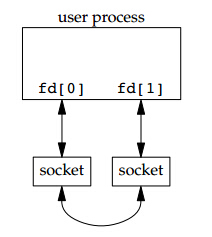
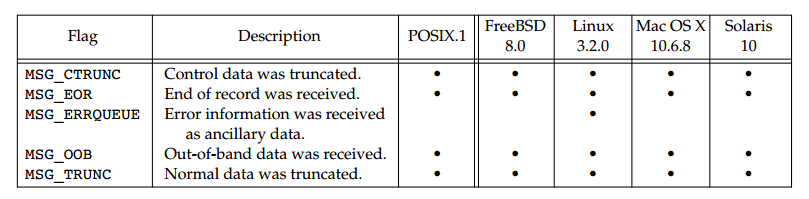

# 进程间传递文件描述符

首先，必须声明，“进程间传递文件描述符”这个说法是错误的。
>在处理文件时，内核空间和用户空间使用的主要对象是不同的。对用户程序来说，一个文件由一
个文件描述符标识。该描述符是一个整数，在所有有关文件的操作中用作标识文件的参数。文件描述
符是在打开文件时由内核分配，只在一个进程内部有效。两个不同进程可以使用同样的文件描述符，
但二者并不指向同一个文件。基于同一个描述符来共享文件是不可能的。
 
>《深入理解Linux内核架构》

这里说的“进程间传递文件描述符”是指，A进程打开文件fileA,获得文件描述符为fdA,现在A进程要通过某种方法，根据fdA,使得另一个进程B,获得一个新的文件描述符fdB,这个fdB在进程B中的作用，跟fdA在进程A中的作用一样。即在fdB上的操作,即是对fileA的操作。

这看似不可能的操作，是怎么进行的呢？

答案是使用匿名Unix域套接字，即socketpair()和sendmsg/recvmsg来实现。

## 关于socketpair

>UNIX domain sockets provide both stream and datagram interfaces. The UNIX
domain datagram service is reliable, however. Messages are neither lost nor delivered
out of order. UNIX domain sockets are like a cross between sockets and pipes. You can
use the network-oriented socket interfaces with them, or you can use the socketpair
function to create a pair of unnamed, connected, UNIX domain sockets.

>APUE 3rd edition,17.2

socketpair的原型为：
```
#include <sys/types.h>
#include <sys/socket.h>

int socketpair(int d, int type, int protocol, int sv[2]);
```
传入的参数sv为一个整型数组，有两个元素。当调用成功后，这个数组的两个元素即为2个文件描述符。

一对连接起来的Unix匿名域套接字就建立起来了，它们就像一个全双工的管道，每一端都既可读也可写。



即，往sv[0]写入的数据，可以通过sv[1]读出来，往sv[1]写入的数据，也可以通过sv[0]读出来。

## 关于sendmsg/recvmsg
通过socket发送数据，主要有三组系统调用，分别是
1. send/recv(与write/read类似，面向连接的)
2. sendto/recvfrom(sendto与send的差别在于，sendto可以面向无连接,recvfrom与recv的区别是,recvfrom可以获取sender方的地址)
3. sendmsg/recvmsg. 通过sendmsg,可以用msghdr参数，来指定多个缓冲区来发送数据，与writev系统调用类似。

sendmsg函数原型如下:
```
#include <sys/socket.h>
ssize_t sendmsg(int sockfd, const struct msghdr *msg, int flags);
```
其中，根据POSIX.1 msghdr的定义至少应该包含下面几个成员：
```
struct msghdr {
    void *msg_name; /* optional address */
    socklen_t msg_namelen; /* address size in bytes */
    struct iovec *msg_iov; /* array of I/O buffers */
    int msg_iovlen; /* number of elements in array */
    void *msg_control; /* ancillary data */
    socklen_t msg_controllen; /* number of ancillary bytes */
    int msg_flags; /* flags for received message */
};
```
在Linux的manual page中，msghdr的定义为:
```
struct msghdr {
    void         *msg_name;       /* optional address */
    socklen_t     msg_namelen;    /* size of address */
    struct iovec *msg_iov;        /* scatter/gather array */
    size_t        msg_iovlen;     /* # elements in msg_iov */
    void         *msg_control;    /* ancillary data, see below */
    socklen_t     msg_controllen; /* ancillary data buffer len */
    int           msg_flags;      /* flags on received message */
         };
```
查看Linux内核源代码(3.18.1)，可知msghdr的准确定义为：
```
struct msghdr {
	void		*msg_name;	/* ptr to socket address structure */
	int		msg_namelen;	/* size of socket address structure */
	struct iovec	*msg_iov;	/* scatter/gather array */
	__kernel_size_t	msg_iovlen;	/* # elements in msg_iov */
	void		*msg_control;	/* ancillary data */
	__kernel_size_t	msg_controllen;	/* ancillary data buffer length */
	unsigned int	msg_flags;	/* flags on received message */
};

```
可见，与Manual paga中的描述一致。

其中，前两个成员msg_name和msg_namelen是用来在发送datagram时，指定目的地址的。如果是面向连接的，这两个成员变量可以不用。

接下来的两个成员,msg_iov和msg_iovlen，则是用来指定发送缓冲区数组的。其中，msg_iovlen是iovec类型的元素的个数。每一个缓冲区的起始地址和大小由iovec类型自包含，iovec的定义为：
```
struct iovec {
    void *iov_base;   /* Starting address */
    size_t iov_len;   /* Number of bytes */
};
```
成员msg_flags用来描述接受到的消息的性质,由调用recvmsg时传入的flags参数设置。recvmsg的函数原型为:
```
#include <sys/socket.h>
ssize_t recvmsg(int sockfd, struct msghdr *msg, int flags);
```
与sendmsg相对应，recvmsg用msghdr结构指定多个缓冲区来存放读取到的结果。flags参数用来修改recvmsg的默认行为。传入的flags参数在调用完recvmsg后，会被设置到msg所指向的msghdr类型的msg_flags变量中。flags可以为如下值:


回来继续讲sendmsg和msghdr结构。

msghdr结构中剩下的两个成员,msg_control和msg_contorllen,是用来发送或接收控制信息的。其中,msg_control指向一个cmsghdr的结构体,msg_controllen成员是控制信息所占用的字节数。

在Linux 的Manual page(man cmsg)中,cmsghdr的定义为:
```
struct cmsghdr {
    socklen_t   cmsg_len;   /* data byte count, including header */
    int         cmsg_level; /* originating protocol */
    int         cmsg_type;  /* protocol-specific type */
    /* followed by  unsigned char   cmsg_data[]; */
};
```

